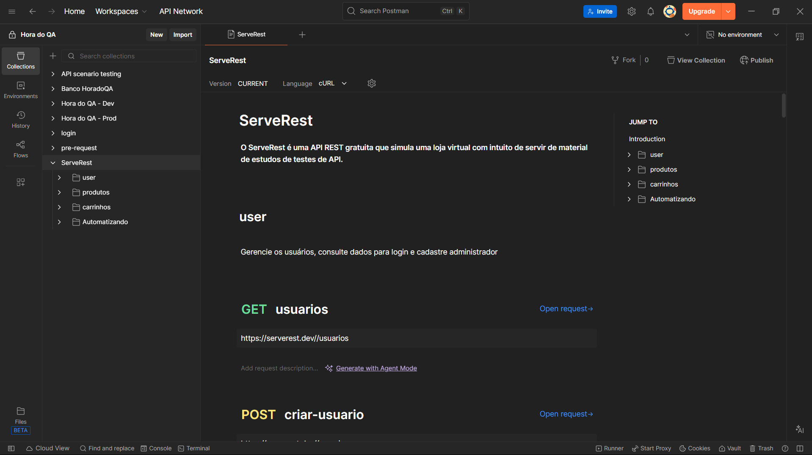
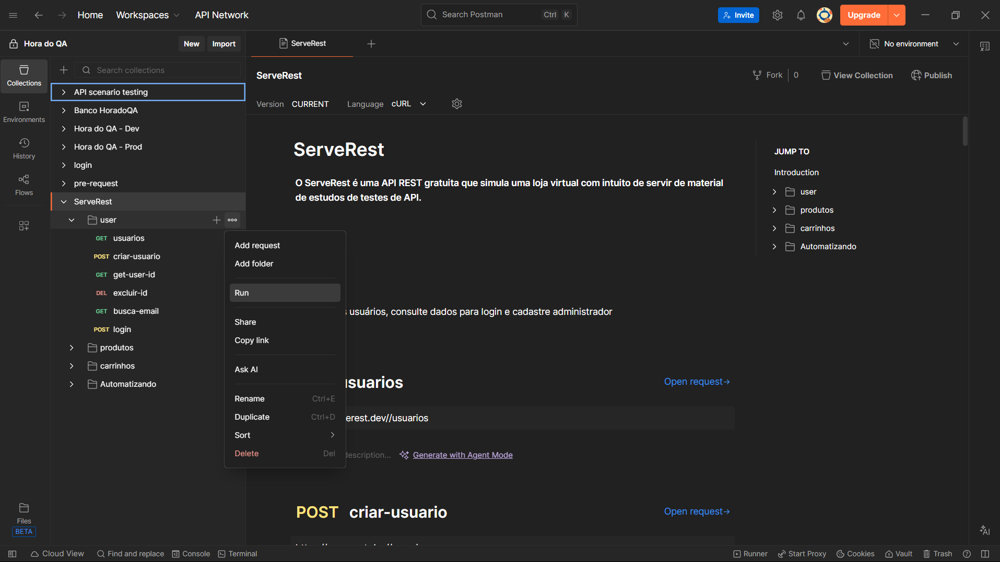
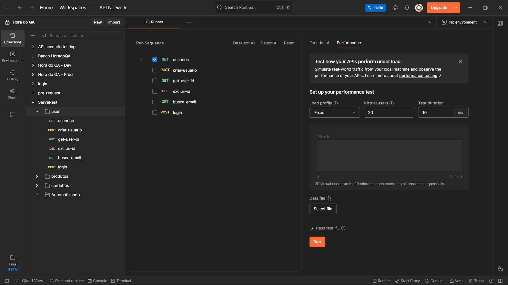
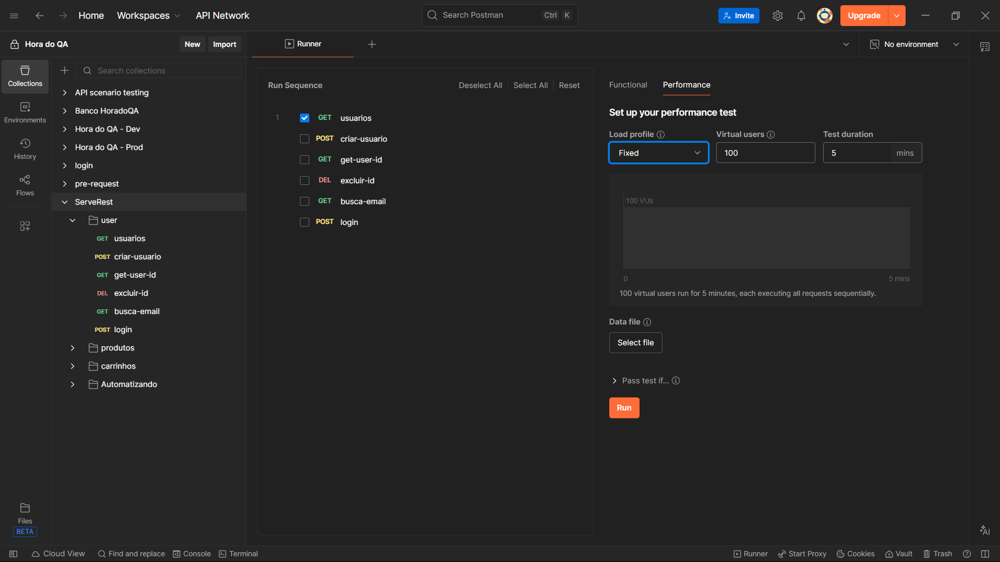
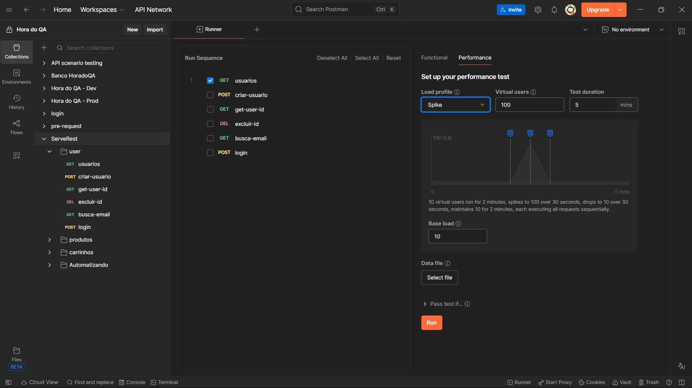
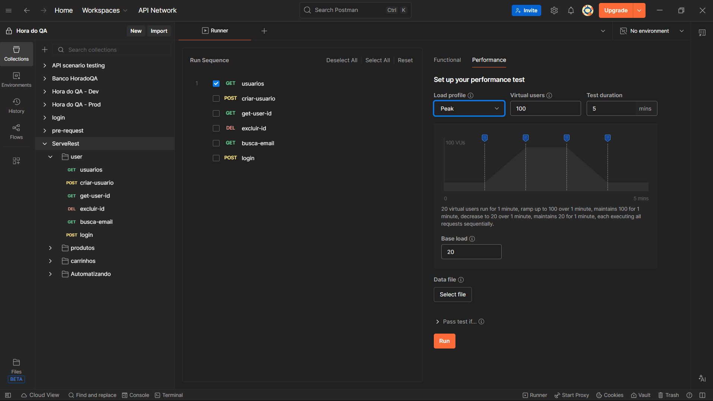
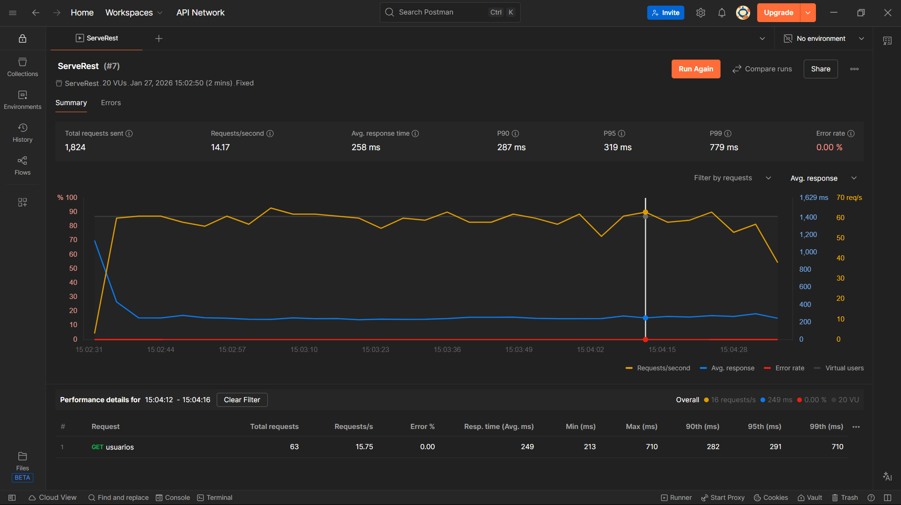

# Criando Testes de Performance no Postman

O Postman **não é uma ferramenta de teste de carga “de verdade”**, mas permite realizar **testes básicos de carga e desempenho** usando alguns recursos adicionais.

Este guia descreve como configurar e executar **testes de performance** no Postman, utilizando diferentes tipos de carga para avaliar o comportamento da aplicação.

---

## Pré-requisitos

* Conta ativa no **Postman**
* Collection previamente criada e configurada
* Requisições com testes e variáveis corretamente definidas

---

## 1. Acessar o Postman

Faça login no Postman com sua conta.

---

## 2. Escolher a Collection

Selecione a **Collection** que contém as requisições que serão testadas.

---

## 3. Selecionar a opção **Run**

No menu da Collection, clique em **Run**.

---

## 4. Escolher o(s) Teste(s) a serem executados

Selecione uma ou mais requisições que farão parte do teste de performance.

---

## 5. Acessar a aba **Performance**

Após selecionar os testes, clique na aba **Performance**.

---

## 6. Configurar os parâmetros do teste

### Tipos de Teste de Performance

#### 🔹 Fixed

20 usuários virtuais executam o teste por **2 minutos**, cada um executando todas as requisições de forma **sequencial**.

---

#### 🔹 Ramp Up

5 usuários virtuais executam por **30 segundos**, aumentam gradualmente para **20 usuários** em mais **30 segundos** e mantêm **20 usuários por 1 minuto**, todos executando as requisições de forma sequencial.

---

#### 🔹 Spike

2 usuários virtuais executam por **50 segundos**, aumentam rapidamente para **20 usuários em 10 segundos**, reduzem para **2 usuários em 10 segundos** e mantêm **2 usuários por mais 50 segundos**, executando as requisições de forma sequencial.

---

#### 🔹 Peak

5 usuários virtuais executam por **20 segundos**, aumentam gradualmente para **20 usuários em 30 segundos**, mantêm **20 usuários por 20 segundos**, reduzem para **5 usuários em 30 segundos** e mantêm **5 usuários por mais 20 segundos**, executando as requisições de forma sequencial.

---

### Virtual Users

Define a **quantidade de usuários virtuais** que irão executar o teste simultaneamente.

---

### Test Duration

Define a **duração total do teste**.

---

## 7. Executar o Teste

Após configurar todos os parâmetros, clique em **Run** para iniciar o teste.

---

## 8. Visualizar Resultados

Após a execução, o Postman exibirá métricas como tempo de resposta, taxa de erro e throughput.

### Resultados por Tipo de Teste

**Fixed**

**Ramp Up**

**Spike**

**Peak**

---

## Observações

* Utilize **Ramp Up** para simular crescimento gradual de usuários.
* Utilize **Spike** para validar a aplicação em picos repentinos de acesso.
* Utilize **Peak** para simular períodos de alta carga sustentada.
* Sempre analise erros e tempos de resposta após cada execução.

---